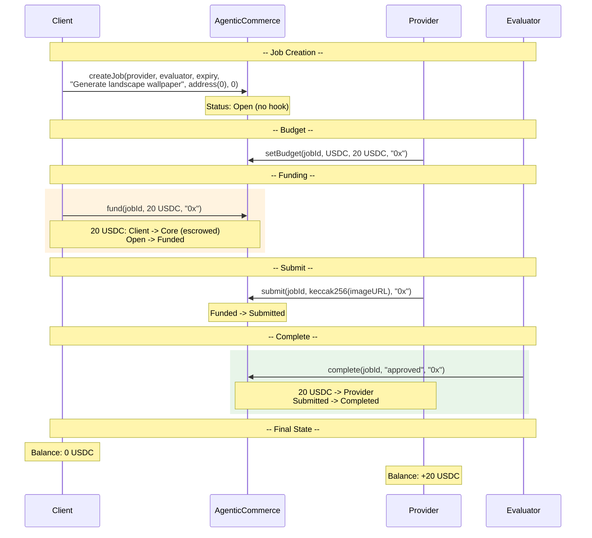
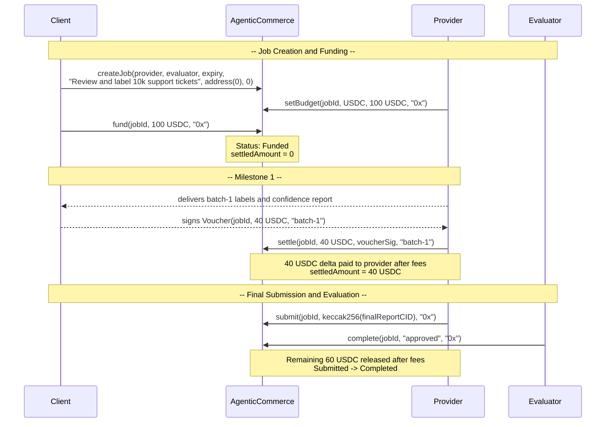

# Demo Flow Diagrams

## Demo 1: Image Generation (No Hook)

A client requests an AI-generated image. No hook is used — the core handles all USDC escrow and payment natively.

No hook involved. Pure core escrow flow.

## Demo 2: Dataset Evaluation with Partial Settlement (No Hook)

A client asks an AI provider to review and label a dataset in two milestones. The client escrows 100 USDC, authorizes a 40 USDC settlement after the first accepted batch, and final completion releases only the unsettled remainder.

